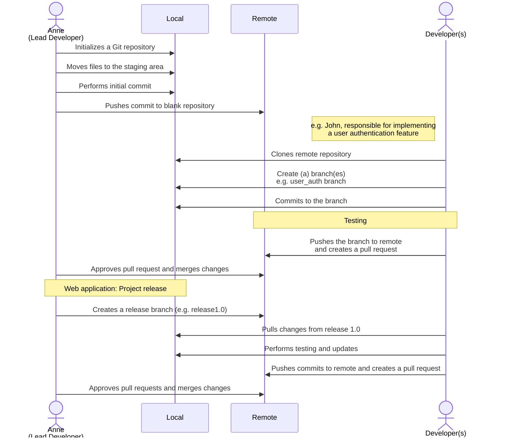

Get started with Git and GitHub in this self-paced, introductory course! You’ll become familiar with collaborative version control and popular Git platforms. Collaboration and social coding are crucial parts of contemporary Software Engineering practices and the DevOps culture.

You will begin this course with an overview of Git and Github fundamentals and explore key Git concepts such as branching and repositories, as well as the use of Git commands. You will also learn and practice various Git concepts such as forking, cloning and merging workflows using hands-on labs. And you’ll learn to use GitHub to work effectively as a team, and perform common Git operations, from both the Web UI and command line. The course wraps up with a final project where you will start building your portfolio by creating and sharing a public/open-source GitHub project. By completing this course you will demonstrate your Git and Github skills as well as add a project to your resume! All hands-on activities in this course can be performed using web-browser based tools and interfaces. Installation of any specialized software is NOT required on your own computer in order to complete the course.

# Module 1: Git and GitHub Fundamentals

2 hours to complete

Application developers rarely work alone. Large web/cloud/mobile development and data science projects will include many people – front-end developers, back-end developers, database administrators, repository administrators, and others. Every change by every contributor must be tracked and controlled to enable collaboration, accountability, and version management. This type of **distributed version control** is extremely important when managing both small and large software projects. In this module, you will learn about some of the popular version control tools, create a GitHub account, and use the GitHub web interface to create a repository, add a file to it, and commit your changes. Branches are the heart of workflows in Git-based version control systems like GitHub. You will also become familiar with ==creating and using branches== and ==merging== your changes to the main branch.
- Define distributed version control.
- List several tools used for version control including popular Git platforms.
- Describe basic git concepts and the purpose of repositories.
- Add/edit files in your repo, and commit changes using the GitHub web interface.
- Create a GitHub account and repository.
- Explain how branches are used and describe pull requests.
- Create GitHub branches and perform merge operations using the GitHub Web interface.

6 videos (24min) 2 readings 3 quizzes 3 plugins

Target Audience:
	- Software Engineers
	- Application Developers
	- Data Scientists
	- Data Engineers

## Version Control 版本控制
Functions
	- Tracks changes to source code 追踪源代码的修改
	- Recovers older versions 恢复旧版本
	- Facilitates collaboration 方便团队合作
Objects
	- Code
	- Images
	- Documents
	- Other file types
## Git
- Free and open-source software under GNU 免费开源软件
- an open-source command-line-based version-control system for software development
- ==**DVCS (distributed version control system) 分布式版本控制系统**==: Users anywhere in the world can have a copy of your project on their computer. When they've made changes, they can sync their version to a remote server to share it with you.
- branching strategies: e.g. feature branching
- tools:
	- command lined interface: *Git Bash*
	- GUI: *GitHub*, *Git Lab*, *Bitbucket*, *Beanstock*...
- basic terms: 
	| Terms | Explanation_EN | Explanation_CN |
	| --- | --- | --- |
	| ==secure shell protocol/SSH protocol 安全外壳协议== | Method to secure remote login | 远程安全登录的方法 |
	| ==Repository 仓库== | A data structure for storing documents, including application source code. It contains the project folders that are set up for version control. | 包含项目文件夹 |
	| ==Fork 复制/复刻/分叉== | Copy of a repository into your GitHub account. | 创建仓库的副本 |
	| ==Pull request 拉取请求== | To request for review and approval | 请求检查和同意 | 
	| ==Working directory 工作目录== | A directory in your file system that contains files and subdirectories on your computer that are associated with a Git repository. | 包含文件和子目录 |
	| ==Commit 提交== | A **snapshot of the project's current state** at a specific point in time, along with a description of the changes made. | 项目当前状态的快照，类似于“保存（到仓库）”功能 | 
	| ==Branch 分支== | Separate line of development | 分支 | A separate line of development that allows to work on features or fixes independently. |
	| ==Merge 合并== | Combines changes from one branch to another | 合并分支中修改的部分 |
	| ==Clone 克隆== | A local copy of the remote Git repository on the computer. | 本地副本 | 
- additional industry-recognized terms
	| Terms | Explanation_EN | Explanation_CN | 
	| --- | --- | --- | 
	| **Continuous delivery (CD)** | The automated movement of software through the software development lifecycle. | 
	| **Continuous integration (CI)** | A software development process in which developers integrate new code into the code base at least once a day. |
	| **Distributed version control system (DVCS)** | A system that keeps track of changes to code, regardless of where it is stored. Multiple users work on the same codebase or repository, mirroring the codebase on their computers if needed, while the distributed version control software helps manage synchronization amongst the various codebase mirrors. |
	| **GitHub** | A web-hosted service for the Git repository. |
	| **GitHub branches** | A branch stores all files in GitHub. Branches are used to isolate changes to code. When the changes are complete, they can be merged back into the main branch. |
	| **GitLab** | A complete DevOps platform delivered as a single application. It provides access to Git repositories, controlled by source code management. |
	| **Git** | Free and open-source software distributed under the GNU General Public License. It is a distributed version control system that allows users to have a copy of their own project on their computer anywhere in the world. |
	| **SSH Protocol** | A method for secure remote login from one computer to another. |
	| **Version control** | A system that allows you to keep track of changes to your documents. This process allows you to recover older versions of the documents if any mistakes are made. |
	
## GitHub
Git - Key characteristics: 
	- strong support for non-linear development 对非线性开发模式的强力支持
	- distributed development 分布式开发
	- compatibility with existing systems and protocols
	- efficient handling of large projects 高效管理大规模项目
	- cryptographic authentication of history 
	- pluggable merge strategies 
GitHub: 
	- an online hosting service for Git repositories 
vs GitLab: 
	- A DevOps platform, delivered as a single application
	- Provides access to Git Repositories
	- Provides source code management
### GitHub ==Repositories==
#### Create a Repository
1. Click <kbd>+</kbd> or `Create repository`
2. Name the repository
3. Write a short description
4. Add a licence
5. Choose `Private` or `Public`

#### Exploring your Repository
1. ==Code== – this is where all the source files reside. Git was initially created as a source code repository and now all sorts of files end up in here. If you created a README and/or license, that’s all that’s here right now. 
2. ==Issues== – as you can imagine, you can track and plan with tools such as “Issues” that lists all open items against your project base. 
3. ==Pull Requests== – this is part of the mechanism for collaborating with other users. Pull requests define changes that are committed and ready for review before being merged into the main branch. 
4. ==Projects== – all the tools for managing, sorting, planning, etc. your various projects. This is the core of the collaborative power of GitHub. 
5. ==Wiki==, ==Security==, and ==Insights== – often left for more advanced users, these tools provide a communication base to the external user community. 
6. ==Settings== – GitHub allows for a lot of personalization, including changing the name of your repository and controlling access. 

#### Lab 实操: GitHub Sign Up and Create Repo
**Estimated time**: 30 minutes

In this lab, you will get started with GitHub by creating a GitHub account and creating a new repository. You will then add a file to the repository using the GitHub web interface.
##### Objectives

After completing this lab, you will be able to:
1. Describe GitHub
2. Create a GitHub account
3. Add a project/repository
4. Create and edit a file
5. Upload and commit a file

##### GitHub overview
Git is an open-source command-line-based version-control system for software development. While Git is a command-line tool and you also need to **host** and **maintain a server** on which you can use Git for versioning.

GitHub is a repository hosting service that uses Git. GitHub provides a web-based hosting service with a graphical user interface(GUI) and git command line interface (CLI). It also provides access control and several collaboration features, such as wikis and basic task management tools, for every project. GitHub provides cloud storage for source code, supports all popular programming languages, and streamlines the iteration process. GitHub includes a free plan for individual developers and for hosting open-source projects.

##### 1. Creating a GitHub account

To create an account in GitHub, complete the following steps:

1. Go to the [Join GitHub](https://github.com/join) page and create an account. **Note**: If you already have a GitHub account, log in now.
    
2. Provide the necessary details to create an account as shown below:
    


3. Verify the account, and then click **Submit**.


4. When you have finished, click **Create account**.


5. You will receive a verification email from GitHub. Click the enclosed link to verify your email or enter the provided verification code. **Note**: If you do not receive a verification email, click **Resend the code**.


6. After entering the provided verification code, you will see a screen that looks like this. This indicates that you are logged into your account and you are ready to start using it.


##### 2. Add a project/repository

To add a new repository, complete the following steps:

1. At the top right of the GitHub home page, click on the "+" icon and select **New repository**.


2. Enter a repository name and select the **Add a README file** check box under the **Initialize this repository with:** option.


3. Click **Create repository**.


4. The repository is created and its home page is displayed.


Next, you'll start editing the repository.

##### 3. Create and edit a file

###### 3.1 **Edit a file**

Although you will normally create a file before you edit it, in this case, the `README.md` file has already been created for you. To edit that file, complete the following steps:

1. Your repository root folder contains just one file: `README.md`. Click the pencil icon at the right to edit the file.


2. Add "It's a markdown file in this repository" text to the file and go to top right and click Commit changes


3. Add some additional description and click **Commit changes**.


4. Confirm that the text you added to the file has been saved.


###### 3.2 **Create a new file**

1. Click on the repository name to go back to the main branch, similar to this repository called `testrepo`.


2. Click **Add file** and select **Create new file** to create a new file in the repository.


3. Enter a file name and extension; for example, `firstpython.py`. Add the lines of code displayed in the following image to your file:


4. Scroll to the top right of the page and click Commit changes.You can optionally add a description of your update (for example, “Adding a new file”). Click **Commit changes** to create your new file.


5. Your file is now added to your repository and the repository listing shows when the file was added or last revised.


##### 4. Upload and commit a file

To upload a local file and commit it to your repository, complete the following steps:

1. On your repository page, click **Add file** and then select **Upload files** to upload a file.


2. Click **choose your files** and choose a file from your computer. You can upload any file (for example, a .txt, .ipynb, or .png file) to the repository.


3. When the file finishes uploading, click **Commit changes**.


4. Your file is uploaded to the repository.


##### Summary
Congratulations! In this lab, you have learned how to create a new repository, add a new file, edit a file, upload a file, and commit your changes. We encourage you to continue to update your repository to become familiar with the processes that you have learned.
- Git is a versatile version control system used for tracking changes in code and collaborating with others on software projects.
- Due to a distributed version control system, Git enables you to revert to the previous state or review the project’s history.
- GitHub is one of the most popular web-hosted services for Git repositories.
- Repositories are storage structures that store documents, including application source code, and enable contributors to track and maintain version control.
- Git repository model
	- Primarily focused on tracking source code during development.
	- Contains elements to coordinate among programmers, track changes, and support non-linear workflows.
- Repositories are storage structures that can hold Code, track Issues, and enable you to collaborate with others.
- GitHub enables you to create repositories, edit files using the web interface, commit the changes to the file, upload the files, and a lot more.

##### Author details
**Authors:**
- Romeo Kienzler
- Malika Singla
**Other contributors:**
- Rav Ahuja
- Upkar Lidder

#### Quiz
1. Which of the following options do you use to request someone to review and approve your project changes before they become final?
	-[x] Commit changes ❌
	-[x] Pull request ✅
	-[] Repository
	-[] Fork
	> Committing your changes saves your changes to the project.
	> A pull request is how you request that someone review and approve your changes before they become final.
2. What is the primary purpose of version control?
	-[] Alters the formatting of the documents
	-[] Allows you to securely log in from one computer to another
	-[x] Allows you to keep track of changes to your documents
	-[] Creates a backup of the documents
3. Which of the following is a feature of the Git Repository model?
	-[] It is based on a binary tree
	-[x] It is a distributed version control system ✅
	-[] It corrects bad code in a project
	-[x] It sorts code into folders and subfolders ❌
	> Sorting code into folders and subfolders is not a feature of the Git repository model.
	> One feature of the Git Repository model is distributed version control. Each team member has a copy of the entire project on their computer, including the project’s files and revision history
4. What is an “organization” in reference to GitHub?
	-[x] A collection of user accounts that own repositories
	-[] A name you must specify for your repository
	-[] The top level of a repository tree
	-[] A path to the code files in a project
5. How will you create a python file in GitHub?
	-[] Settings > Select Create New File> Commit changes
	-[] Select Add File > Select upload files > Choose Your Files > Add File > Add the code > Commit changes to the repository
	-[x] Select Add File > Select Create New File> Provide the file name > Add a comment > Add the code > Commit changes to the repository
	-[] Settings > Select Create New File> Pull Requests

### GitHub ==Branches==
Definition: 
- Branches store all files in GitHub. GitHub上的分支存储所有文件。
- Main branch stores the deployable code. 主干存储可部署的代码。
- A branch is a snapshot of your repository to which you can make changes.
- In the child branch, you can build, make edits, test the changes, and then merge them with the main branch.
- To ensure that changes are made by one member, do not impede or affect the workflow of other members, multiple branches can be created and merged with the main branch.    
- A pull request is a way to notify other team members of the changes and edits made to the main branch.

#### ==Merging== branches 
1. Start with a **common base** 所有分支始创于共同的基础。
2. Code is branched while new features are developed 代码会在新创建的分支上开发新功能。
3. Both branches are undergoing changes 主干和分支同时工作。
4. When two streams of work are ready to merge, each branch's code is identified as a **tip** 两个工作流准备好合并时，每个分支上的代码会被认为“tip”。
5. Two tips are merged into a third, combined branch 两个“tips”合并成第三个分支。
##### Lab 实操: Make a ==commit==
To change the contents of a file
	1. Select file
	2. Click `pencil` icon
	3. Make changes
	4. Scroll down to find `Commit changes`
Save changes = commits
	1. In `Commit changes` box, add a ***comment (Commit message)*** describing the changes
		1. Don't end the comment message with a period 不要以句号结尾
		2. Keep commit messages under 50 characters 50字以下
		3. Use the extended window for the details 使用拓展窗口补充细节
		4. Always write in an active voice 用主动语态
	2. Choose to commit directly to the current branch or to create a new branch
	3. Click `Commit changes`

#### ==Pull Request== 拉取请求
Definition & Functions: 
	- Makes the proposed (committed) changes available for others to review and use 已提交的修改能让其他人审阅和使用
	- Can follow any commits, even if code is unfinished 尽管代码未完成，也能跟踪提交的内容。
	- Can target specific users 能标注具体用户
	- GitHub automatically makes a pull request if you make a change on a branch you do not own. <br>如果你在其他人的分支上作出修改，GitHub会自动拉取请求。
	- Log files record the approval of the merge 日志文件记录同意合并的记录

##### Lab 实操: Open a pull request
1. Click `Pull requests` and select `New pull request`
2. Select the new branch from the compare box
3. Confirm that changes are what you want to assess
4. Add a title and description to the request
5. Click `Create pull request`
##### Lab 实操: Merging into the main branch (the only deployed code 唯一可部署的代码)
- Developers can change source files in a branch. 开发者可以在一个分支上修改源文件。
- Changes are not released until 只有进行以下操作后，才会发布修改后的内容
	- Committed
	- Pull command is issued
	- Code is reviewed and approved
	- Approved code is merged into the main 
		1. Click `Merge pull request`
		2. Click `Confirm merge`
		3. Delete the obsolete branch

#### Lab 实操: Branching and Merging (Web UI)
**Estimated time**: 15 minutes
##### Objectives
After completing this lab, you will be able to:
1. Create a branch
2. Commit changes to a child branch
3. Open a pull request
4. Merge a pull request into the main branch

##### Prerequisites
This hands-on lab requires you to have created a GitHub account with a repository in it, as covered in [Getting started with GitHub](https://cf-courses-data.s3.us.cloud-object-storage.appdomain.cloud/IBMDeveloperSkillsNetwork-CD0101EN-SkillsNetwork/labs/GitHubLabs/GitHub1_Getting_Started.md.html) lab.

> NOTE: In the past the default branch in your GitHub repo used the name `master`. Effective Oct 1, 2020, all new GitHub repositories will use the more inclusive term `main` as the name of the default branch instead of `master`.

##### 1. Create a branch

You can create or delete branches using your repository's GitHub web page. To add a branch to your repository, complete the following steps:

1. Go to your repository's main page. Note that when you created your repository, the one branch named **main** was created for you.


2. At the top of the file list, locate the **Branch** drop-down menu. (By default, the menu displays **Branch: main**.) Click the drop-down menu, type the name of the branch you want to create, and press `Enter` or `return` on your keyboard.


Your repository now has two branches: **Main** and **Child_Branch**. You can click the drop-down menu to see your branches.


Any files that were in the **main** branch are reflected in the **Child_Branch**. Note that when you add or edit a file in Child_Branch, that change will not automatically reflect in the main branch

##### 2. Add a file to a branch

To add a file to your new branch, ensure that the name you gave the new branch (which in the case of the example showcased is **Child_Branch**) is displayed in the **Branch** drop-down menu and complete the following steps:

1. Click **Add file > Create new file** to create a file in the repository.


2. Type a name and extension for the file, for example, `testchild.py`, and add the following lines to the body of the new file:


3. Scroll to the bottom of the page, add a description of the file you are about to add (note that the description is optional), and click **Commit**.


The file is added to your child branch.

##### 3. Open a pull request

The file that you added to your child branch is not automatically added to the **main** branch. (You can check this by using the **Branch** drop-down menu to go to the **main** branch; note that there is no `testchild.py` file in the file list).


You can also compare the two branches and open a _pull request_, which will enable you to merge the changes that you've made in the child branch – in this case, adding a new file – to the **main** branch.

1. In **Child_Branch**, click the **Compare & pull request** button.


2. Scroll to the bottom of the page and note that there is **1 changed file** listed and the changes are highlighted in green.


3. Scroll up and note that GitHub is comparing the **main** and **Child_Branch** branches and that there are no conflicts between the two. Optionally, you can add a comment to the pull request. Click **Create pull request**.


The pull request has been successfully created and is now ready to be merged by a repository administrator. For all the repositories that you create, you automatically have administrative rights.

##### 4. Merge a pull request

To merge a pull request into a project, complete the following steps:

1. Click the **Pull requests** tab. A list of pending pull requests is displayed.


2. Click the pull request that you want to merge into the main project. Review the changes, click **Merge pull request** to accept the pull request and merge the updates. (You can optionally add a comment.)


3. When you click **Merge pull request**, a **Confirm merge** button is displayed. Click that button to complete the merge.


The pull request has now been merged successfully. Note that you can delete the child branch because your changes have been incorporated into the **main** branch.


Check the list of files in the **main** branch to confirm that it now includes the file that you added in the pull request.


##### Summary

Congratulations! You've now learned how to create a branch, edit and commit changes in that branch, open a pull request, and merge the pull request into your main project. We encourage you to continue to experiment with branches and pull requests to become more familiar with the concepts and processes.
##### Author details
**Author:**
- Malika Singla
**Other contributor:**
- Rav Ahuja

#### Quiz: Branches with GitHub
1. Which of the following does the main branch store?
	-[] The original and unchanged versions of the code
	-[x] The deployable version of the project code
	-[] The project files, including files from forks
	-[] The files that contain documentation only
2. Which of the following best describes the function of a pull request? 
	-[x] Shows the difference in the content between the child branch and the main branch ✅
	-[] Helps to merge the child branch with the main branch
	-[x] Facilitates the creation of a child branch ❌
	-[] Helps to create a copy of the main branch
	> A pull request does not contribute to the creation of the child branch.
3. Identify the correct statement.
	-[x] You can add files in the child branch without adding any to the main branch.
	-[] If you add a file to the child branch, it will automatically reflect in the main branch.
	-[] It is not possible to add a file to the child branch.
	-[] To add a file to the child branch, you need to add it to the main branch first.


## Quiz: Git and GitHub Fundamentals 
1. What is the relation between Git and GitHub?
	-[] GitHub is an open-source tool used to create Git.
	-[x] GitHub is an online hosting service for Git repositories.
	-[] GitHub is a main section in the Git project workflow.	
	-[] GitHub is a program required for version control on Git.
2. Which of the following describes a repository?
	-[] A basic unit of storage in Git that cannot be changed
	-[] A plain text file that explains the purpose of a project
	-[x] A data structure that stores documents and source code
	-[] A collection of user accounts that are connected to a pull request
3. What is the purpose of a ==license==?
	-[] To record all changes made to a repository
	-[] To establish a secure remote login between computers
	-[] To describe the purpose of the project
	-[x] To express how people can use your code
4. What is the role of “commit” in GitHub?
	-[] To merge
	-[x] To save changes
	-[] To pull requests
	-[] To undo changes
5. What type of version control system is Git?
	-[] Local
	-[x] Distributed
	-[] Centralized
	-[] Remote
6. Which of the following statements is associated with a working directory?
	-[] Contains project folders that are set up for version control
	-[] A separate line of development that allows one to work independently
	-[x] Contains the files and subdirectories on the computer that are associated with a Git repository
	-[] Copy of a repository
7. What happens if you make a change on a repository branch that you don't own?
	-[x] GitHub makes a pull request
	-[] GitHub issues a push request for the owner.
	-[] GitHub undoes the changes.
	-[] GitHub generates an error message.

# Module 2: Git Commands and Managing GitHub Projects
2 hours to complete

As you start working with GitHub repositories and automating workflows, using the web interface can be limiting and more time-consuming. This is where Git commands come in. You can use it from your own desktop, or a virtual desktop provided through the Cloud IDE #### wherever you develop your code. In this module, you will become familiar with and utilize various Git commands to clone and fork repositories, as well as commit, push, and pull your changes using the command line.
- Describe the function of Git commands like push, pull, and fetch.
- Use Git commands to create and manage code branches
- Differentiate between cloning and forking GitHub projects.
- List the roles common in large projects.
- Execute Git commands to work with GitHub repositories from a terminal.
- Create a fork and clone of a GitHub repository, make code changes, and submit a pull request.

6 videos (33min) 1 reading 2 quizzes 2 app items 3 plugins

## Git Workflows
### typical workflow in a software development project
1. Cloning the remote repository 克隆远程仓库
2. Pushing & pulling changes 
3. Implementing the feature in local repository 
	```mermaid
		sequenceDiagram
		
		Participant LC As Local Computer
		Participant RR As Remote Repository 
		
		RR->>LC:Code with version history
		LC->>RR:Push
		RR->>LC:Pull
		Note left of LC: feature implementation
	```
4. Creating a branch
	```mermaid
	sequenceDiagram
	Participant Changes
	Participant MB As Main Branch
	
	Changes-->MB:❌
	Note over Changes,MB: until code ready
	
	MB->>Branch: add a feature <br>without interfering
	```
5. Committing files
	```mermaid
	sequenceDiagram
	Participant F As Files
	Participant SA As Staging Area
	Participant Branch
	Participant RR As Remote Repository
	F->>SA: 
	SA->>Branch: Commit
	Note over SA, Branch: Implemented product <br>recommendation feature
	Branch->>RR:Push
	```
6. Reviewing code
	```mermaid
	sequenceDiagram
	Participant PR As Pull Request
	Actor M As Maintainer
	Participant MB As Main branch in the remote repository
	
	M->>MB: Code review
	
	Note left of M: to merge branch
		
	PR->>M: Code review
	M->>MB: Merge
	```

### start a project from scratch and intend to collaborate with others
1. Starting a new project
2. Committing and pushing files
	```mermaid
	sequenceDiagram
	Participant F As Files
	Participant SA As Staging Area
	Participant LPD As Local Project Directory
	Participant RR As Remote Repository
	
	Note over SA: Local
	
	F->>SA: 
	SA->>LPD: Initial Commit
	
	loop Link
		LPD-->RR: Push
	end

	RR->>Cloned Repository: by other Developers
	```

### Scenario: Web application development


## Git Commands

General command-line commands: 
	- `mkdir`: make new directory
	- `cd`: navigate to the directory

Git commands: 
|   |   |   |
|---|---|---|
 
|Git Commands|Functions|Examples|
|`git init`|1. New repository; <br>2. Sets up necessary files and data structures for project's version control|   |
|`git add [FILE.SUFFIX]`|Moves changes from the working directory to the staging area;|`git add index.html`|
|`git commit` <br>`git commit -m "[REMARKS]"`|Saves the changes with a descriptive message|`git commit -m "Created a new HTML file"`|
|`git log`|Enables to browse previous changes to a project|   |
|`git branch [FILE]`|lists, creates, renames and even deletes branches within a Git repository|`git branch code_list`|
|`git checkout [FILE]`|Allows to switch between existing branches|`git checkout code_list`|
|`git add [FILE.SUFFIX]`|Push the new changes to the staging area|`git add index.html`|
|`git commit` <br>`git commit -m "[REMARKS]"`|Commit the changes|`git commit -m "Updated index.html file in branch"`|
|`git status`|Allows to view the status of all changes|   |
|`git merge [FILE]`|Allows to merge the feature branch to the main branch|`git merge code_list`|

In this reading, you will summarize and describe additional Git commands that you may use while working on your projects. You will also look at the syntax for each command.

Git is a widely used version control system that offers numerous benefits to developers and teams working on software development projects.

Let's look at some useful Git commands and understand them:
1. **`git add`**
    - _Description_: It adds changes to the staging area. This command stages the changes made to the files and prepares them for the next commit.
    - _Syntax_:
        - **`git add <filename.txt>`** (to add a specific file)
        - **`git add .`** (to add all the files that are new or changed in the current directory)
        - **`git add -A`** (to add all changes in the entire working tree, from the root of the repository, regardless of where you are in the directory structure)
2. **`git reset`**
    - _Description_: It resets changes in the working directory. When used with –hard HEAD, this command discards all changes made to the working directory and staging area and resets the repository to the last commit (HEAD).
    - _Syntax_:
        - **`git reset`**
        - **`git reset –hard HEAD`**
3. **`git branch`**
    - _Description_: It lists, creates, or deletes branches in a repository. To delete the branch, first check out the branch using **git checkout** and then run the command to delete the branch locally.
    - _Syntax_:
        - **`git branch`** (to list branches)
        - **`git branch <new-branch>`** (to create a new branch)
        - **`git branch -d <branch-name>`** (to delete a branch)
4. **`git checkout main`**
    - _Description_: It switches to the "main" branch. This will switch your current branch to "main."
    - _Syntax_: **`git checkout main`**
5. **`git clone`**
    - _Description_: It copies a repository from a remote source to your local machine. This will create a copy of the repository in your current working directory.
    - _Syntax_: **git clone \<repository URL\>**
6. **`git pull`**
    - _Description_: It fetches changes from a remote repository and merges them into your local branch. First, switch to the branch that you want to merge changes into by running the **git checkout** command. Then, run the **git pull** command, which will fetch the changes from the main branch of the origin remote repository and merge them into your current branch.
    - _Syntax_: **`git pull origin main`**
7. **`git push`**
    - _Description_: It uploads local repository content to a remote repository. Make sure you are on the branch that you want to push by running the **git checkout** command first, then push the branch to the remote repository.
    - _Syntax_: **`git push origin <branch-name>`**
8. **`git version`**
    - _Description_: It displays the current Git version installed on your system.
    - _Syntax_: **`git version`**
9. **`git diff`**
    - _Description_: It shows changes between commits, commit and working tree, etc. It also compares the branches.
    - _Syntax_:
        - **`git diff`** (shows the difference between the working directory and the last commit)
        - **`git diff HEAD~1 HEAD`** (shows the difference between the last and second-last commits)
        - **`git diff <branch-1> <branch-2>`** (compares the specified branches)
10. **git revert**
    - _Description_: It reverts a commit by applying a new commit. This will create a new commit that undoes the changes made by the last commit.
    - _Syntax_: **git revert HEAD**
11. **`git config –global user.email <Your GitHub Email>`**
    - _Description_: It sets a global email configuration for Git. This needs to be executed before doing a commit to authenticate the user's email ID.
    - _Syntax_: **`git config –global user.email <Your GitHub Email>`**
12. **`git config –global user.name <Your GitHub Username>`**
    - _Description_: It sets a global username configuration for Git. This needs to be executed before doing a commit to authenticate users' username.
    - _Syntax_: **`git config –global user.name <Your GitHub Username>`**
13. **`git remote`**
    - _Description_: It lists the names of all remote repositories associated with your local repository.
    - _Syntax_: **`git remote`**
14. **`git remote -v`**
    - _Description_: It lists all remote repositories that your local Git repository is connected to, along with the URLs associated with those remote repositories.
    - _Syntax_: **`git remote -v`**
15. **`git remote add origin <URL>`**
    - _Description_: It adds a remote repository named "origin" with the specified URL.
    - _Syntax_: **`git remote add origin <URL>`**
16. **`git remote rename`**
    - _Description_: The git remote rename command is followed by the name of the remote repository (origin) you want to rename and the new name (upstream) you want to give it. This will rename the "origin" remote repository to "upstream."
    - _Syntax_: **`git remote rename origin upstream`**
17. **`git remote rm <name>`**
    - _Description_: It adds a remote repository named "origin" with the specified URL.
    - _Syntax_: **`git remote rm origin`**
18. **`git format-patch`**
    - _Description_: It generates patches for email submission. These patches can be used for submitting changes via email or for sharing them with others.
    - _Syntax_: **`git format-patch HEAD~3`** (creates patches for the last three commits)
19. **`git request-pull`**
    - _Description_: It generates a summary of pending changes for an email request. It helps communicate the changes made in a branch or fork to the upstream repository maintainer.
    - _Syntax_: **`git request-pull origin/main <myfork or branch_name>`**
20. **`git send-email`**
    - _Description_: It sends a collection of patches as emails. It allows you to send multiple patch files to recipients via email. Please make sure to set the email address and name using the **git config** command so that the email client knows the sender's information when sending the emails.
    - _Syntax_: **`git send-email *.patch`**
21. **`git am`**
    - _Description_: It applies patches to the repository. It takes a patch file as input and applies the changes specified in the patch file to the repository.
    - _Syntax_: **`git am <patchfile.patch>`**
22. **`git daemon`**
    - _Description_: It exposes repositories via the Git:// protocol. The Git protocol is a lightweight protocol designed for efficient communication between Git clients and servers.
    - _Syntax_: **`git daemon –base-path=/path/to/repositories`**
23. **`git instaweb`**
    - _Description_: It instantly launches a web server to browse repositories. It provides a simplified way to view repository contents through a web interface without the need for configuring a full web server.
    - _Syntax_: **`git instaweb –httpd=webrick`**
24. **`git rerere`**
    - _Description_: It reuses recorded resolution of previously resolved merge conflicts. Please note that rerere.enabled configuration option needs to be set to "true" (**git config –global rerere.enabled true**) for git rerere to work. Additionally, note that git rerere only applies to conflicts that have been resolved using the same branch and commit.
    - _Syntax_: **`git rerere`**

Author: Anamika Agarwal
Other Contributor: Lavanya T S

```Git
git init

git checkout

git revert

git-format-patch

git fetch upstream

git status

git merge

git config --global user.email

git-request-pull

git merge upstream/main

git add .

git clone

git config --global user.name

git-send-email

git pull upstream

git commit 

git pull

git remote -v

git-am

git web

git log

git push

git remote rename

git-daemon

git-instaweb

git reset

git version

git remote add origin

git remote -v

git-pull downstream

git branch

git diff

git-remote

git remote add upstream

git-rerere
```
### Demo: Working with Branches using Git Commands


You would typically use Git commands from your own desktop/laptop. However, so you can get started using the commands quickly without having to download or install anything, we are providing an IDE with a Terminal on the Cloud. Simply click the "Launch App" below to launch the Skills Network Cloud IDE and in the new browser tab that launches, follow the instructions to practice the Git commands. After completing this lab you will be able to use git commands to start working with creating and managing your code branches, including:

1. create a new local repository using git init
    
2. create and add a file to the repo using git add
    
3. commit changes using git commit
    
4. create a branch using git branch
    
5. switch to a branch using git checkout
    
6. check the status of files changed using git status
    
7. review recent commits using git log
    
8. revert changes using git revert
    
9. get a list of branches and active branch using git branch
    
10. merge changes in your active branch into another branch using git merge
    

If you are unable to open the lab or view it properly, please click [here](https://cf-courses-data.s3.us.cloud-object-storage.appdomain.cloud/IBM-CD0131EN-SkillsNetwork/labs/git-branch-commands/instructions.md.html "Open lab instructions in new window.") to view the HTML version full screen in a new browser tab.

---

This course uses a third-party app, Hands-On Lab: Getting Started with Branches using Git Commands, to enhance your learning experience. The app will reference basic information like your name, email, and Coursera ID.
## ==Cloning== and ==Forking== GitHub Projects
### Cloning vs Forking
### Managing GitHub Projects


### 2 quizzes•Total 31 minutes

#### Graded Quiz: Git Commands and Managing GitHub Projects •21 minutes
#### Practice Quiz: Git Workflows with Git Commands•10 minutes

### 2 app items•Total 50 minutes

#### Hands-On Lab: Getting Started with Branches using Git Commands•25 minutes
#### Hands-On Lab: Cloning and Forking GitHub Projects•25 minutes

### 3 plugins•Total 29 minutes

#### Reading: Git Commands•15 minutes
#### Cheat Sheet: Git Commands and Managing GitHub Projects •10 minutes
#### Glossary: Git Commands and Managing GitHub Projects •4 minutes

# Module 3: Final Project and Assessment

4 hours to complete

Now that you are familiar working with GitHub repositories, Branches, and Git commands, in this module you will apply your knowledge and skills to create a GitHub Project, add few files to it such as an open-source license, and share it publicly.

## What's included

1 video 2 readings 1 peer review 2 app items 5 plugins

Hide info about module content

### 1 video•Total 5 minutes

#### [Optional] GitHub Copilot•5 minutes•[Preview module](https://www.coursera.org/lecture/getting-started-with-git-and-github/optional-github-copilot-9Kj6D)

### 2 readings•Total 7 minutes

#### Congratulations and Next Steps•2 minutes
#### Thanks from the Course Team•5 minutes

### 1 peer review•Total 30 minutes

#### Final Project: Submit Your Work and Review Your Peers•30 minutes

### 2 app items•Total 105 minutes

#### Practice Project: Part 2 - Git CLI•45 minutes
#### Final Project: Part 2 - Git CLI•60 minutes

### 5 plugins•Total 95 minutes

#### Practice Project: Overview•15 minutes
#### Practice Project: Part 1 - GitHub UI•30 minutes
#### Final Project: Overview and Grading Criteria•15 minutes
#### Final Project: Part 1 - GitHub UI•30 minutes
#### Course Glossary: Git and GitHub•5 minutes

# Module 4: [Optional] Working with GitHub from Your Windows Desktop

1 hour to complete

In this module, you will learn to install Git Bash on your Windows machine and configure an SSH key to work with your GitHub repo using Git commands on your system.